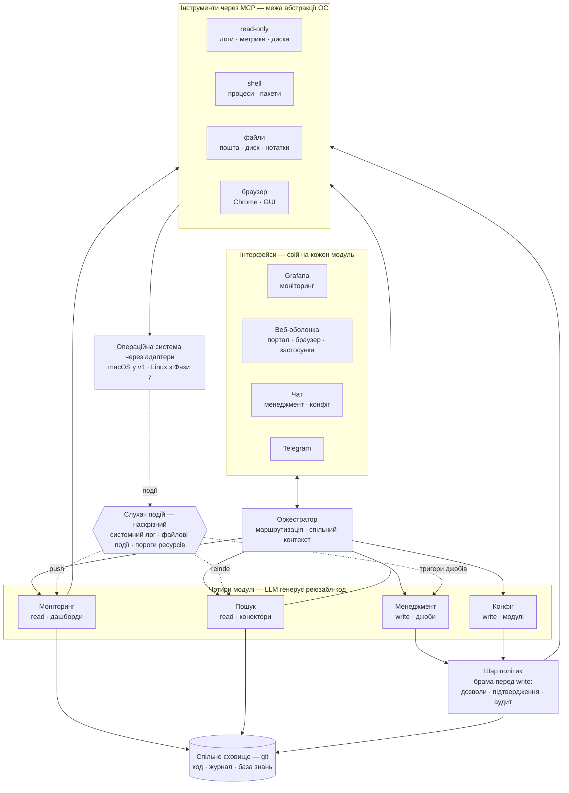
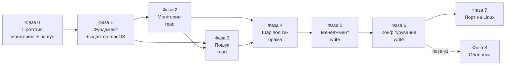

# CytoblastOS — агентний інтерфейс до операційної системи

Продукт: агентний інтерфейс до операційної системи, який закриває чотири її функції через агентів. Кожен модуль має власний інтерфейс, власний спосіб розширення (LLM генерує реюзабл-код, що далі виконується як готова аплікація) і власні конфігурації, які згодом стають специфікацією модуля.

Порядок реалізації: моніторинг → пошук і перегляд → менеджмент → конфігурування (від read-only до write, від найменшої ціни помилки до найбільшої).

| Модуль | Інтерфейс для користувача | Як розширяється (генерований реюзабл-код) | Конфігурації → специфікація |
|---|---|---|---|
| Моніторинг | Панель дашбордів і графіків, аналог Grafana; сповіщення приходять у чат (push) | Дашборди як код (JSON), правила алертів, кастомні експортери метрик | Джерела метрик, пороги і канали алертів, розклад збору |
| Пошук і перегляд | Пошуковий рядок з фасетами і прев'ю результатів, аналог Spotlight/Recoll | Конектори-індексатори до нових джерел (пошта, нотатки, PDF), збережені іменовані запити, екстрактори форматів | Перелік джерел і шляхів, розклад переіндексації, схеми фасетів |
| Менеджмент | Стрічка операцій у стилі рев'ю: план → дифф → підтвердження → виконання → відкат | Операції як параметризовані джоби ("почисти кеші", "розклади фото за роками"), кожна в парі з undo-скриптом | Каталог джобів, рівень автономії на кожен (auto / підтвердження), retention снапшотів для відкату |
| Конфігурування | Дифф-в'ю "поточний стан проти бажаного" з історією поколінь і відкатом | Декларативні модулі під кожен намір ("VPN до офісу", "нічний бекап") | Репозиторій системних конфігів — тут конфіг і є специфікацією; безпека і дозволи входять сюди |

## Наскрізні елементи

- Оркестратор: чат зверху, який маршрутизує запит у потрібний модуль і тримає спільний контекст.
- Слухач подій: один на всі модулі. Моніторинг бере його для алертів, пошук — для інкрементальної переіндексації, менеджмент — для тригерів джобів.
- Двосторонні панелі: з будь-якого графіка, результату чи джоба — дія "поясни / зроби", що повертає контекст в оркестратор.
- Бібліотека коду: згенерований код зберігається з метаданими наміру; перед генерацією нового агент шукає готовий і перевикористовує.
- Шар політик: дві точки контролю — ревью коду при генерації (перед збереженням) і дозволи при виконанні. Активний з другого модуля (менеджмент).

## Два режими довіри

- Read-функції (моніторинг, пошук): дешева швидка модель, без підтверджень.
- Write-функції (менеджмент, конфігурування): за брамою політик, сильніша модель, обов'язкове підтвердження незворотного і можливість відкату.

## Градієнт розширення

Що далі по порядку реалізації, то ближче згенерований артефакт до самої системи: конфіги (моніторинг) → конектори (пошук) → джоби (менеджмент) → декларативні модулі системи (конфігурування).

## Повний функціонал ОС, розкладений по 4 групах

Перевірка, що чотири модулі покривають усі очікування користувача від ОС. Кожна функція віднесена до свого модуля; наскрізні вимоги (безпека, відкат, проактивність) реалізуються не окремим модулем, а спільними елементами вище.

### Моніторинг

- Статус системи за запитом: ресурси, температура, мережа
- Пошук того, що споживає ресурси ("чому гальмує")
- Перегляд запущених застосунків і процесів
- Діагностика: читання логів, "чому впало"
- Здоров'я дисків
- Сповіщення про важливе: місце на диску, батарея, оновлення, збої (push)

### Пошук і перегляд

- Пошук файлів за назвою, вмістом, датою, типом
- Єдиний пошук по файлах, пошті, нотатках, історії
- Запити на кшталт "де документ, який я редагував минулого тижня"
- Відкриття і перегляд файлів
- Історія дій агента і системи

### Менеджмент

- Запуск і закриття застосунків
- Завершення завислих процесів
- Створення, перейменування, переміщення, копіювання файлів
- Архівація і розпакування
- Звільнення місця: великі файли, дублікати, кеші
- Резервне копіювання і відновлення версій
- Передача файлів через пошту, месенджер, хмару
- Встановлення, видалення і оновлення пакетів
- Відкат змін (виконується як операція менеджменту)

### Конфігурування

- Мережа: Wi-Fi, VPN, проксі
- Звук, екран, енергоживлення
- Периферія: принтери, Bluetooth, зовнішні диски
- Локаль, час, розкладки клавіатури
- Керування автозапуском
- Безпека і доступ: сесії, користувачі, дозволи, оновлення безпеки, шифрування
- Секрети: делегуються менеджеру паролів (агент не бачить значень)
- Налаштування подій і регулярних задач (розклади, тригери)

### Що лишається наскрізним, а не окремим модулем

- Проактивність: механізм push і розкладів. Живе у слухачі подій; напрямок дій задається в конфігуруванні, спрацьовує в моніторингу і менеджменті.
- Відкат: виконується менеджментом, але як інваріант вимагає, щоб кожна write-операція лишала слід (снапшот, покоління, запис у журналі).
- Безпека і дозволи: частина конфігурування як налаштування, але застосовується в рантаймі як шар політик перед кожною write-дією.

## Концепція продукту: веб-ОС з агентним керуванням

Найточніша аналогія — ChromeOS, але з двома власними вимірами. ChromeOS звів операційну систему до веб-оболонки поверх схованого Linux: файли, налаштування, застосунки живуть у браузерному шарі. Ця система бере ту саму форму й додає:

- Керування через LLM замість кліків — кожна дія має два шляхи: звичний клік або запит до агента для складного.
- Генерація коду як механізм розширення замість встановлення готових застосунків — користувач описує намір, агент генерує модуль, кладе в бібліотеку, і можливість починає існувати. ОС дорощує собі функції за запитом.

### Як чотири модулі лягають на цю форму

- Веб-оболонка = шар застосунків ChromeOS: увесь інтерфейс з файлами через веб, користувач оперує файлами через цю оболонку.
- Чотири модулі = вбудовані застосунки (файли/менеджмент, монітор, налаштування/конфігурування, пошук).
- ОС під ними = схований ядровий шар (у v1 macOS, Linux — з Фази 7 плану реалізації).
- MCP-сервери = драйвери між веб-шаром і системою; вони ж — межа абстракції ОС.

### Портал контенту (SharePoint-подібний)

Модуль пошуку і перегляду переростає простий пошук і стає керованим порталом контенту:

- Бібліотеки документів замість сирих папок; версії; права доступу.
- Метадані й типи контенту поверх файлів — цю роль грає онтологія (семантична система типів).
- Композиція сторінок з віджетів — оболонка, яку легко розширяти власними модулями (аналог веб-партів).
- Пошук стає семантичним, а не повнотекстовим: "усі документи, пов'язані з міграцією, які я не відкривав місяць".

Що пишемо самі: індексатор з онтологією і менеджер пошуку. Що беремо готове: рушій рендерингу (вбудований webview у власній оболонці на Tauri або Electron) — власний браузер писати немає сенсу, потрібна розширювана оболонка.

### Спільне сховище (база знань)

Аудит-леджер, бібліотека згенерованого коду і база знань — це одна сутність, не три сховища: структурований markdown-репозиторій під git (формат у стилі Obsidian — плоскі файли зі зв'язками). Шар політик його наповнює, модуль пошуку індексує й читає, менеджмент використовує для перевикористання коду. Тримати як одне сховище, інакше — проблеми синхронізації.

### Центральний компроміс

ChromeOS герметичний — застосунки в пісочниці, доступ до системи обмежений навмисно; безпеку дає ізоляція. Цей задум протилежний: агент з повними правами на всю систему. Тобто це "ChromeOS навпаки" за філософією доступу — герметичність обмінюється на всемогутність, і платою за це є дисципліна шару політик: підтвердження, аудит і відкат несуть те навантаження, яке в ChromeOS несе пісочниця.

Застереження для v1: на macOS «повні права» — умовність. SIP закриває системні шляхи навіть під root, а TCC вимагає окремої згоди користувача на доступ до Документів, Фото і Робочого столу. Частину навантаження, яку тут покладено на шар політик, фактично несе сама ОС; натомість діалоги TCC заважають безобслуговним джобам. Деталі — у розділі про шар абстракції ОС.

## Оболонка як універсальне вікно ОС

Веб-оболонка модуля пошуку виростає в повноцінне вікно ОС із трьома ролями в одному:

1. Браузер інтернету — серфінг зовнішніх сторінок.
2. В'юер контенту — перегляд документів, PDF, зображень, markdown з бази знань.
3. Хост усіх згенерованих застосунків — агент пише застосунок як веб-модуль, кладе в бібліотеку, оболонка відкриває його у вкладці. Розширення = нова вкладка, а не встановлення.

Технічно всі три ролі — той самий вбудований webview (Chromium), різниться лише джерело сторінки: зовнішній сайт, локальний документ чи згенерований застосунок. Це шар застосунків у стилі ChromeOS. Серфінг не пишемо з нуля — обпираємось на Claude in Chrome (вже є як MCP); наша робота — оболонка, вкладки і хостинг згенерованих застосунків.

### Ключовий ризик: ізоляція недовіреного вебу від агента

Щойно вікно ходить у відкритий інтернет, воно стає каналом атаки на систему з повними правами: веб-сторінка може містити prompt injection, а агент з повним доступом — саме та мішень. У ChromeOS від цього рятує пісочниця; тут її немає за задумом. Тому вимоги, які треба закласти в архітектуру з самого початку:

- Недовірений веб-контент не має прямого каналу до агента з правами. Веб може лише *попросити* дію — вона проходить через шар політик і підтвердження, а не виконується напряму.
- Серфінг, згенеровані застосунки і ядро ізольовані одне від одного.
- Згенеровані застосунки не отримують повний доступ автоматично — лише явно наданий обмежений набір можливостей.

### Обсяг

Універсальний браузер — ціль, а не частина v1. За масштабом це окремий продукт рівня перших чотирьох модулів разом. У v1 модуль пошуку обмежується в'юером власних форматів; серфінг і хостинг застосунків додаються пізніше.

## Фінальна архітектура (діаграма)

Читання: інтерфейс кожного модуля → оркестратор маршрутизує й тримає контекст → модулі поділені за режимом довіри (read проходить повз політики, write — через браму) → MCP-інструменти над ОС через адаптер платформи. Слухач подій наскрізний: живить push трьом модулям, не належить жодному. Спільне сховище — одна сутність для коду, журналу і бази знань.

## План реалізації по фазах

План розгортає порядок «моніторинг → пошук → менеджмент → конфігурування» у дев'ять фаз. Три відмінності від простого списку модулів:

- **Спершу прототип, потім фундамент.** Фаза 0 — тонкий вертикальний зріз (моніторинг плюс мінімальний пошук), який перевіряє головну гіпотезу на живому коді. Фаза 1 будує спільну основу вже на досвіді прототипу, а не на здогадках про те, якою вона має бути.
- **Шар політик — окрема фаза-брама, а не частина менеджменту.** Він ставиться між read- і write-модулями, і його критерій завершення перевіряється на безпечному стенді до того, як з'явиться перша реальна write-операція.
- **Одна платформа в v1, друга — з Фази 7.** Продукт стартує тільки на macOS; Linux приходить окремою фазою. Але кордон абстракції ОС закладається у Фазі 1, разом із фундаментом, — його не можна відкласти до появи другої платформи.

Кожна фаза закінчується наскрізним сценарієм, який працює без ручного втручання, — це і є критерій завершення. Фаза не вважається закритою, поки сценарій не проходить від запиту в чаті до сліду в журналі.

### Інваріанти, які перевіряються на кожній фазі

Це не побажання, а умови приймання. Порушення будь-якого з них — привід не закривати фазу. Фаза 0 — свідомий виняток: прототип на те й прототип, інваріанти вмикаються з Фази 1.

- Кожна write-операція лишає слід: снапшот, покоління або запис у журналі. Операція без сліду не потрапляє в реліз.
- Перед генерацією коду агент спершу шукає готовий у бібліотеці. Дубль замість перевикористання — дефект, а не дрібниця.
- Сховище одне (код + журнал + база знань). Нова потреба не заводить другого сховища.
- Слухач подій один. Модуль не піднімає власний, а підписується на спільний.
- Read проходить повз політики, write — тільки через браму. Обхідних шляхів немає навіть «тимчасово для дебагу».
- Платформна специфіка живе тільки в адаптері ОС. Команда конкретної системи в коді модуля, оркестратора чи згенерованого джоба — дефект.

### Шар абстракції ОС: спершу macOS, Linux — Фаза 7

v1 працює тільки на macOS. Linux виноситься в окрему фазу, але кордон абстракції ставиться у Фазі 1, разом із фундаментом. Причина: абстракцію не можна додати заднім числом дешево — до моменту появи другої платформи специфіка встигає врости у чотири модулі, бібліотеку коду і слухач подій, і порт перетворюється на другу розробку.

Межа абстракції вже названа в архітектурі: MCP-сервери — драйвери між веб-шаром і системою. Отже, контракт інструмента (ім'я, схема, семантика результату) не залежить від ОС, а адаптер під кожну систему його реалізує. З цього випливає чотири правила:

- Жоден модуль, оркестратор чи згенерований джоб не викликає платформну команду напряму. `launchctl`, `brew`, `systemctl`, `apt` існують тільки всередині адаптера. Це перевіряє перша точка контролю шару політик — ревью згенерованого коду (Фаза 4).
- Контрактні тести пишуться у Фазі 1 разом із першим адаптером: один набір сценаріїв, який зобов'язаний пройти будь-який адаптер. Саме вони роблять Фазу 7 портом, а не переписуванням.
- Бібліотека коду стає платформно-теговою: у фронтматері з'являється платформа (`macos`, `linux`, `any`). Артефакт, що торкається шляхів або команд системи, тегується; пошук перевикористання враховує тег, інакше на Linux підтягнеться macOS-джоб.
- Адаптер уміє повертати «немає дозволу» і «не підтримується на цій платформі» як штатний результат, а не як помилку.

| Здатність | macOS (v1) | Linux (Фаза 7) |
|---|---|---|
| Файлові події | FSEvents | inotify |
| Системні логи | unified logging (`log`) | journald |
| Розклади й автозапуск | launchd | systemd (units, timers) |
| Пакети | Homebrew | apt / dnf / pacman |
| Мережа | `networksetup`, `scutil` | NetworkManager |
| Живлення й екран | `pmset` | logind, специфіка DE |
| Точки відновлення | APFS local snapshots (`tmutil`) | btrfs / ZFS snapshots, timeshift |
| Системні налаштування | `defaults`, plist, профілі | конфіг-файли, dconf, декларативні менеджери |

Два наслідки вибору macOS, які варто знати заздалегідь:

- **Снапшоти — найплатформозалежніша частина брами.** Контракт формулюється як «створити точку відновлення» і «відкотитися до неї», але на macOS повний відкат тому робиться через Recovery, тож на рівні окремого джоба основним механізмом лишається undo-скрипт, а снапшот працює як страховка. На Linux із btrfs або ZFS відкат чесніший. Це різниця в гарантіях, а не тільки в реалізації, — і її треба відобразити в тому, що система обіцяє користувачеві.
- **SIP і TCC змінюють центральний компроміс.** Задум передбачає агента з повними правами, але macOS цього не дає навіть під root: SIP закриває системні шляхи, TCC вимагає згоди користувача на доступ до Документів, Фото, Робочого столу. Частину ізоляції, яку в задумі несе шар політик, тут бере на себе сама ОС — це радше на користь, але діалоги TCC ламають безобслуговні джоби. Тому модель можливостей Фази 4 має трактувати відмову за дозволом як нормальний очікуваний стан, а не як збій.

### Фаза 0 — Прототип (моніторинг і мінімальний пошук)

Мета: перевірити головну гіпотезу продукту на живому коді — що LLM генерує реюзабл-код, який справді працює як аплікація, — і зробити це до того, як заморожені контракти зроблять зміну дорогою. Прототип не має бути гарним; він має відповісти на питання, які інакше довелось би вгадувати у Фазі 1.

Обсяг — тонкий вертикальний зріз на macOS, прямі виклики без контрактів:

- Чат, що відповідає на два-три питання про стан системи.
- Кілька метрик і один згенерований дашборд — перша перевірка циклу «намір → код → працює».
- Пошук файлів за назвою, датою і типом. Без онтології, фасетів і конекторів.
- Журнал у найпростішій формі: що спитали, що згенерували, що виконали.

Свідомо не входить: шар політик, будь-які write-операції, бібліотека з метаданими наміру, слухач подій як окремий процес, адаптер ОС.

Справжній продукт цієї фази — не демо, а три списки на вхід у Фазу 1:

- системні виклики, які повторюються, — з них виростає контракт адаптера;
- метадані, яких бракувало згенерованому коду, — з них виростає фронтматер бібліотеки;
- події, на які захотілось реагувати, — з них виростає слухач подій.

Критерій завершення: демо на macOS — «чому гальмує», «знайди файл, який я редагував учора» і один графік, згенерований на запит.

Умова, без якої прототип обертається технічним боргом: інтеграційний код Фази 0 оголошується одноразовим наперед. Лишаються UI, сценарії й висновки; викидається все, що безпосередньо ходить у систему. Якщо цей код доживе до Фази 5, платформна специфіка і відсутність контрактів вростуть у продукт саме там, де ціна помилки найвища.

### Фаза 1 — Фундамент (на досвіді прототипу)

Мета: спільна основа, у яку далі вставляються модулі, спроєктована за фактичними потребами прототипу, а не за уявленням про них.

Обсяг:

- **Спільне сховище**: git-репозиторій markdown, схема тек, фронтматер (намір, тип, платформа, версія, зв'язки), формат запису журналу. Заводиться до першої write-операції, щоб інваріант сліду не довелось вбудовувати заднім числом.
- **Оркестратор**: маршрутизація запиту в модуль і спільний контекст сесії.
- **Слухач подій як один процес**: пороги ресурсів, системний лог, файлові події.
- **MCP як межа абстракції ОС**: контракт інструментів, адаптер macOS, контрактні тести.
- **Бібліотека коду** з метаданими наміру і правилом «шукай перед генерацією».
- **Перенесення сценаріїв прототипу** на цей фундамент.

Критерій завершення: усі три сценарії демо з Фази 0 працюють знову — але вже через оркестратор, MCP-адаптер і спільне сховище, і кожен лишає запис у журналі. Контрактні тести проходять на адаптері macOS.

Рішення, які треба ухвалити саме тут: хост моделі (локальна чи API) і правило маршрутизації «дешева / сильна».

### Фаза 2 — Моніторинг (read)

Мета: довести моніторинг із прототипу до повного модуля — на найдешевшій ціні помилки.

Обсяг:

- Збирачі метрик і правила алертів; канал push через слухач подій із Фази 1.
- Панель дашбордів; сповіщення в чат.
- **Що генерує LLM**: дашборди як код (JSON), правила алертів, кастомні експортери метрик.
- **Конфігурації**: джерела метрик, пороги і канали алертів, розклад збору.
- Перша реальна робота бібліотеки коду: згенерований дашборд зберігається з метаданими наміру, наступний схожий запит його знаходить і перевикористовує.

Критерій завершення: на «чому гальмує» приходить відповідь із топом споживачів; запит «покажи графік температури за добу» породжує згенерований дашборд, який лягає в бібліотеку і відкривається в панелі; повторний схожий запит бере готовий артефакт, а не генерує новий; алерт про місце на диску приходить у чат сам.

### Фаза 3 — Пошук і перегляд (read)

Мета: другий read-модуль і одночасно апгрейд бібліотеки коду — саме тут пошук за наміром стає семантичним, а не збігом підрядка.

Обсяг:

- Індексатор з онтологією і менеджер пошуку — пишемо самі.
- Конектори-індексатори до джерел; екстрактори форматів; фасети; збережені іменовані запити.
- Інкрементальна переіндексація на файлових подіях зі спільного слухача (у v1 — FSEvents через адаптер macOS).
- В'юер власних форматів: markdown, PDF, зображення. **Серфінг і хостинг згенерованих застосунків — поза v1** (Фаза 8).
- Індексація самого спільного сховища: журнал і бібліотека коду стають шуканими нарівні з файлами користувача.
- **Що генерує LLM**: конектори до нових джерел, екстрактори, збережені запити.
- **Конфігурації**: перелік джерел і шляхів, розклад переіндексації, схеми фасетів.

Критерій завершення: «де документ, який я редагував минулого тижня» повертає результат із прев'ю; пошук за наміром знаходить у бібліотеці код, створений у Фазі 2, за описом задачі, а не за назвою файлу.

### Фаза 4 — Шар політик (брама перед write)

Мета: поставити браму до того, як з'явиться перша операція, що змінює систему. Фаза без користувацької функції — її цінність у тому, що наступні дві фази неможливо зробити недисципліновано.

Обсяг:

- **Перша точка контролю**: ревью згенерованого коду перед збереженням у бібліотеку.
- **Друга точка контролю**: дозволи при виконанні — модель можливостей, обов'язкове підтвердження незворотного.
- **Механізм сліду**: снапшоти й покоління за контрактом адаптера — «створити точку відновлення» і «відкотитися до неї». У v1 реалізація на APFS local snapshots; це ключове технічне рішення фази, від нього залежить, наскільки чесним буде відкат у Фазах 5 і 6.
- **Генерація діффу і dry-run**: показати наслідки до виконання.
- **Аудит**: запис у спільне сховище на кожен прохід через браму, зокрема на відмови.
- **Безпечний стенд**: одноразова macOS-VM, де руйнівні операції перевіряються без ризику для робочої системи.
- **Дозволи як штатний стан**: відмова TCC або закритий SIP шлях повертаються з адаптера як очікуваний результат, який брама вміє показати користувачеві, а не як збій виконання.

Критерій завершення: на стенді свідомо небезпечна операція зупиняється брамою і лишає запис в аудиті; дозволена операція проходить, лишає снапшот і відкочується до попереднього стану.

### Фаза 5 — Менеджмент (write)

Мета: перша функція, що змінює систему, — уже за готовою брамою.

Обсяг:

- Стрічка операцій у стилі рев'ю: план → дифф → підтвердження → виконання → відкат.
- **Що генерує LLM**: операції як параметризовані джоби, кожна обов'язково в парі з undo-скриптом. Джоб без undo не приймається — це той самий інваріант сліду на рівні артефакту.
- **Конфігурації**: каталог джобів, рівень автономії на кожен (auto чи підтвердження), retention снапшотів.
- Тригери джобів зі спільного слухача подій.
- Перевикористання перед генерацією працює вже на повному пошуку з Фази 3.
- Кожен джоб тегується платформою у фронтматері; пакетні операції в v1 ідуть через Homebrew в адаптері, а не з коду джоба.

Критерій завершення: «почисти кеші» проходить повний цикл — план, дифф, підтвердження, виконання — і відкочується назад до стану до запуску; джоб, позначений як auto, спрацьовує від події без участі користувача і теж лишає слід.

### Фаза 6 — Конфігурування (write)

Мета: найдорожча ціна помилки і найглибший рівень доступу — останній модуль v1.

Обсяг:

- Дифф-в'ю «поточний стан проти бажаного», історія поколінь, відкат на попереднє покоління.
- **Що генерує LLM**: декларативні модулі під намір («VPN до офісу», «нічний бекап»).
- **Конфігурації**: репозиторій системних конфігів — тут конфіг і є специфікацією.
- Безпека і дозволи як налаштування; секрети делегуються менеджеру паролів, агент не бачить значень.
- Налаштування розкладів і тригерів — саме тут задається напрямок проактивності, яку виконують Фази 2 і 5.
- Шар поколінь пишеться самостійно поверх `defaults`, plist, профілів і launchd: у macOS немає готового декларативного шару рівня NixOS, тому «бажаний стан» доводиться і описувати, і звіряти власним кодом.

Критерій завершення: «підніми VPN до офісу» породжує декларативний модуль, показує дифф поточного і бажаного стану, застосовується як нове покоління і відкочується на попереднє; секрет при цьому жодного разу не потрапляє ні в контекст моделі, ні в журнал.

### Фаза 7 — Порт на Linux

Мета: друга платформа як доказ, що абстракція справжня. Якщо Фазу 1 зроблено чесно, ця фаза не торкається жодного модуля.

Обсяг:

- Другий адаптер під контракт із Фази 1: inotify, journald, systemd, менеджер пакетів, NetworkManager, снапшоти btrfs або ZFS.
- Прогін контрактних тестів на новому адаптері. Розбіжності в поведінці фіксуються в контракті, а не обходяться всередині модулів.
- Ревізія бібліотеки коду: артефакти з тегом `macos` або узагальнюються до `any`, або отримують linux-пару.
- Перевірка Фази 6 на Linux: тут конфігурування може спертись на готові декларативні менеджери, тобто модуль стає сильнішим, ніж був на macOS.

Критерій завершення: усі наскрізні сценарії Фаз 2–6 проходять на Linux без змін у коді модулів; єдине, що додалось, — адаптер і платформні артефакти бібліотеки.

Порядок Фаз 7 і 8 не жорсткий — вони незалежні. Linux іде першим, бо перевіряє вже зроблене, тоді як оболонка додає нову поверхню.

### Фаза 8 — Оболонка як універсальне вікно (поза v1)

За масштабом це окремий продукт рівня перших чотирьох модулів разом, тому виноситься за межі v1 і починається тільки після Фази 6.

Обсяг: вбудований webview (Tauri або Electron) у трьох ролях — браузер, в'юер контенту, хост згенерованих застосунків; серфінг спирається на Claude in Chrome через MCP, пишемо оболонку, вкладки і хостинг.

Передумова, без якої фазу не починати: ізоляція недовіреного вебу від агента з повними правами. Веб може лише *попросити* дію, і запит проходить через браму Фази 4; серфінг, згенеровані застосунки і ядро ізольовані одне від одного; згенерований застосунок отримує лише явно наданий обмежений набір можливостей.

### Ризики і відкриті питання плану

- **Головний ризик прототипу — що він не помре.** Фаза 0 корисна рівно доти, доки її інтеграційний код лишається одноразовим. Найдешевша страховка: тримати прототип в окремій гілці чи теці й на вході у Фазу 1 переносити з нього сценарії й висновки, а не файли.
- **Механізм снапшотів на macOS дає слабші гарантії.** APFS local snapshots створюють точку відновлення, але повний відкат тому проходить через Recovery, тож на рівні джоба несучою конструкцією лишається undo-скрипт. Рішення потрібне у Фазі 4; від нього залежить, що саме система обіцяє користувачеві словом «відкат».
- **Бібліотека коду потрібна раніше за пошук.** Перевикористання вмикається у Фазі 2, а семантичний індекс приходить лише у Фазі 3. Розрив закриває плоский пошук по фронтматеру з Фази 1; поки він діє, дублі коду ловляться вручну на ревью.
- **Панель моніторингу: вбудувати Grafana чи писати свою.** У таблиці модулів сказано «аналог Grafana», на діаграмі — «Grafana». Рішення потрібне на вході у Фазу 2: готова Grafana економить фазу, але власна панель краще лягає на двосторонні панелі («поясни / зроби») і на майбутню оболонку.
- **Telegram присутній на діаграмі, але не описаний у тексті.** Незрозуміло, це повноцінний інтерфейс чи лише канал push-сповіщень. Обсяг треба зафіксувати до Фази 2, бо push з'являється саме там.
- **Інтерфейс до менеджера паролів не визначено.** Який саме менеджер і як агент замовляє секрет, не бачачи значення, — питання Фази 6, але воно впливає на модель можливостей у Фазі 4. У macOS напрошується Keychain, і тоді питання перетворюється на те, як агент отримує доступ, не отримуючи значень.
- **Конфігурування на macOS слабше, ніж на Linux.** Немає готового декларативного шару, тому покоління доводиться будувати самим поверх `defaults`, plist і профілів. Фаза 7 не лише переносить модуль, а й підсилює його — це варто закласти в очікування, щоб різниця в глибині між платформами не читалась як регрес.
- **Розбіжність у нумерації.** У розділі «Наскрізні елементи» шар політик названо активним «з другого модуля (менеджмент)», хоча в порядку реалізації менеджмент третій. Цей план трактує так: шар політик активний з першої write-функції, тобто з менеджменту.

## Опис для GitHub

Однорядковий (для поля About репозиторію):

> CytoblastOS — агентний інтерфейс до операційної системи: один чат керує моніторингом, пошуком, менеджментом і конфігуруванням, а агент дорощує собі інструменти, генеруючи реюзабл-код.

Коротка версія для шапки README:

> CytoblastOS перетворює операційну систему на діалог. Замість того щоб пам'ятати команди й перемикатися між утилітами, ви говорите системі, що зробити, а вона сама обирає потрібний модуль — моніторинг, пошук, менеджмент чи конфігурування. Кожна нова задача вчить систему: LLM генерує код під намір, зберігає його в бібліотеці й перевикористовує наступного разу. Модулі, що лише читають (моніторинг, пошук), працюють одразу; ті, що змінюють систему (менеджмент, конфігурування), проходять через шар політик — дозволи, підтвердження незворотного, відкат. Назва — від клітинної біології: cyto- (клітина, вмістище) + -blast (паросток, точка росту) — система як клітина-зародок, що вирощує власні функції.

### English (for GitHub About field)

> CytoblastOS — an agentic interface to your operating system: one chat drives monitoring, search, management, and configuration, while the agent grows its own tools by generating reusable code.
